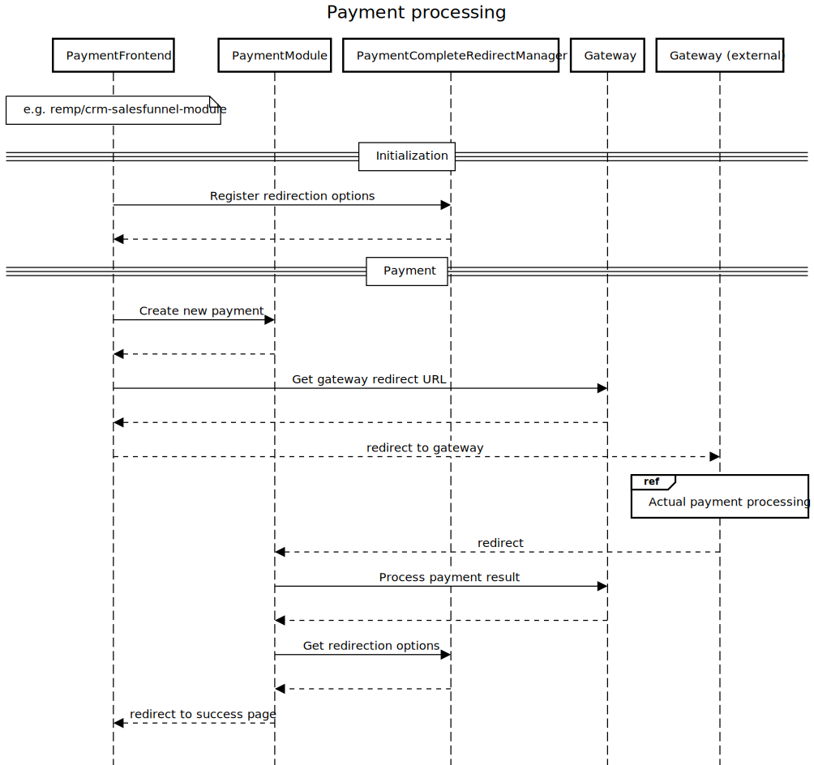
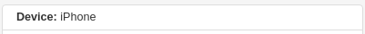
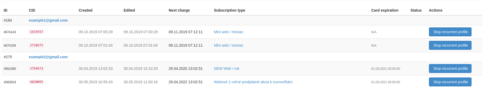
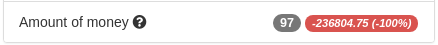
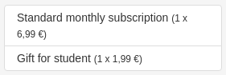
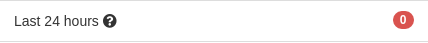
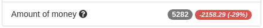

# CRM Payments Module

## Installing module

We recommend using Composer for installation and update management.

```shell
composer require remp/crm-payments-module
```

### Enabling module

Add installed extension to your `app/config/config.neon` file.

```neon
extensions:
	- Crm\PaymentsModule\DI\PaymentsModuleExtension
```

Add following commands to your scheduler (e.g. *crontab*) and change the path to match your deploy path:

```shell
# charge available recurrent payments
*/15 * * * * flock /tmp/payments_charge.lock /usr/bin/php /var/www/html/bin/command.php payments:charge

# pre-calculate payment-related metadata
04 04 * * * /usr/bin/php /var/www/html/bin/command.php payments:calculate_averages
```

### Scheduled commands

For payment module to work correctly, please add execution of following commands to your scheduler. Example displays
crontab usage for execution (alter paths to your deploy paths):

```
# calculate payment related averages; expensive calculations that should be done nightly
04 04 * * * php /var/www/html/bin/command.php payments:calculate_averages

# recurrent payment charges; using flock to allow only single instance running at once
*/15 * * * * flock /tmp/payments_charge.lock /usr/bin/php /var/www/html/bin/command.php payments:charge

### OPTIONAL 

# failcheck to prevent payments not working without anyone noticing (see command options) 
*/10 * * * * php /var/www/html/bin/command.php payments:last_payments_check --notify=admin@example.com

# try to acquire debit card expiration dates for cards that don't have it
*/10 * * * * php /var/www/html/bin/command.php payments:update_recurrent_payments_expires

# stop recurrent payments with expired cards
7 2 1 * * php /var/www/html/bin/command.php payments:stop_expired_recurrent_payments

# if you use Cardpay/Comfortpay gateways and bank sends you email notifications, you can confirm payments based
# on those emails
*/3 * * * * php /var/www/html/bin/command.php payments:tatra_banka_mail_confirmation
```

### Service commands

Module might provide service commands to be run in the deployed environment. Mostly to handle internal changes
and to prevent direct manipulation with the database. You can display required and optional arguments by using
`--help` switch when running the command.

Payments module doesn't provide service commands.

## Payment gateways

Module has a default set of supported payment gateways developed and used by us:

* *Bank Transfer.* Gateway generates unfinished payment and displays user bank account, amount and transaction
identification so the payment can be paired and confirmed later.
* *Cardpay* (tatrabanka.sk). One-time card payment provided by Slovak bank.
* *Comfortpay* (tatrabanka.sk). Recurrent card payment provided by Slovak bank (CRM is handling charging)
* *CSOB* (csob.cz). One-time card payment provided by Czech bank.
* *CSOB One Click* (csob.cz). Recurrent card payment provided by Czech bank (CRM ish handling charging)
* *Paypal* (paypal.com). One-time payment provided by major global provider.
* *Paypal Reference* (paypal.com). Recurrent payment provided by major global provider (CRM is handling charging)
* *Tatrapay* (tatrabanka.sk). One-time payment linked to Slovak bank's internet banking.

### Standard (one-time) payments

Standard and initial recurrent payment have common beginning of process. Once the system generates instance of new
payment, user can be redirected to payment gateway for processing. Each gateway requires different set of parameters
to be provided, therefore gateway is responsible for generating the redirect URL with all required parameters.
  
As `remp/crm-payments-module` is responsible only for actual payment processing, frontend flow can be managed by our
[`remp/crm-salesfunnel-module`](https://github.com/remp2020/crm-salesfunnel-module) which provides a way to create
sales funnels (payment windows), aggregates statistics and displays user success page after the payment with possibility
to extend it with widgets.
 
After the payment, user is directed back to the CRM. Each gateway provides its own URL where user is directed for
payment completion processing.

If the payment is successful, payments module uses [`PaymentCompleteRedirectManager`](extensions/payments-module/src/model/SuccessPageResolver/PaymentCompleteRedirectManager.php)
to determine what kind of success page the user should see. If `crm-salesfunnel-module` is used, user is directed
to the success page registered by the module.

The flow of payment processing can be described with following diagram:



### Recurrent payments

If the payment uses gateway that supports recurrent payment, the initial flow is usually the same as with the regular
payments. The difference comes in during processing of successful initial payment.

PaymentsModule creates new instance of *recurrent payment* - a profile defining when the system should charge user again,
and what *subscription type* will the user get when charged.

Each *recurrent payment* instance represent a single payment that will be charged in the future. That means, that if
the charge fails, system creates new *recurrent payment* with charge date calculated based on retry rules and stores
failing information to the original recurrent payment. Similarly, if the charge was successful, new subscription is created
and new *recurrent payment* is defined to be charged in the next period. Thanks to that the system is able to provide
information about each charge attempt for whole history of user charging including the bank approval/failure code.

This is all done on backend without system requiring any kind of user interaction. This block merely explains the
flow and describes the terms so when displayed in CRM admin, the reader understands the displayed data.

To charge the user, add `payments:charge` command to your scheduler. Command doesn't handle concurrent runs - that means
that it's responsibility of your scheduler to prevent multiple overlapping instances of command running at the same time.
Otherwise a user could be charged twice during the same period.

We recommend using `flock` or some other locking tool which will prevent command to be execute while the previous
instance is still running. Following is an example snippet for *crontab* to run the charging every 15 minutes:

```sh
*/15 * * * * flock /tmp/payments_charge.lock /usr/bin/php /var/www/html/bin/command.php payments:charge
``` 

### Implementing new gateway

You can implement and integrate new gateways to the CRM if necessary. Based on whether you're implementing standard
or recurrent gateway, you implementation should implement just [`Crm\PaymentsModule\Gateways\PaymentInterface`](./extensions/payments-module/src/model/Gateway/PaymentInterface.php)
or the former and [`Crm\PaymentsModule\Gateways\RecurrentPaymentInterface`](./extensions/payments-module/src/model/Gateway/RecurrentPaymentInterface.php).

When implementing a gateway, we recommend extending [`Crm\PaymentsModule\Gateways\GatewayAbstract`](./extensions/payments-module/src/model/Gateway/GatewayAbstract.php)
to avoid implementing parts which are always similar and would cause code duplication.

Once you have your implementation ready, you need to seed it into the database from within seeder in your own module
(see [PaymentGatewaysSeeder](extensions/payments-module/src/seeders/PaymentGatewaysSeeder.php) as an example)
and register it into the application's configuration:

```neon
services:
	# ...
	- Crm\FooModule\Gateways\Foo
	# ...
	gatewayFactory:
		setup:
			- registerGateway(foo, Crm\FooModule\Gateways\Foo)
```

Then, add *seeder* that will insert the gateway to database. See [`Crm\PaymentsModule\Seeders\PaymentGatewaysSeeder`](./extensions/payments-module/src/seeders/PaymentGatewaysSeeder.php)
as an example *seeder* implementation and [register seeders](https://github.com/remp2020/crm-skeleton#registerseeders) section
of CRM skeleton documentation too see how the seeders should be registered in your module.

### Adding PaymentCompletedRedirectResolver

If you want to change the success page displayed to user after the payment based on any arbitrary rule - for example
your gateway might want user to see some special offering or require him to enter some additional data - you can register
*redirect resolver* to process this request. When the payment is confirmed, redirect resolver will decide (based on
priority of registered resolvers) whether to redirect user to a special success page or whether a default success page
(if `remp/crm-salesfunnel-module` is used) is sufficient.

The implementation of redirect resolver can look like this:

```php
<?php

namespace Crm\FooModule\Model;

use Crm\PaymentsModule\Model\PaymentCompleteRedirectResolver;
use Nette\Database\Table\ActiveRow;

class FooPaymentCompleteRedirectResolver implements PaymentCompleteRedirectResolver
{
    public function wantsToRedirect(?ActiveRow $payment, string $status): bool
    {
        if ($payment && $status === self::PAID) {
            return $payment->payment_gateway->code === 'foo_gateway';
        }
        return false;
    }

    public function redirectArgs(?ActiveRow $payment, string $status): array
    {
        if ($payment && $status === self::PAID) {
            return [
                ':Foo:SalesFunnel:Success',
                ['variableSymbol' => $payment->variable_symbol],
            ];
        }
        throw new \Exception('unhandled status when requesting redirectArgs (did you check wantsToRedirect first?): ' . $status);
    }
}
```

In the example the resolver first checked whether the redirection should happen for this particular payment - it should
happen if the payment was done via `foo_gateway`. Then the `redirectArgs` method returns array of arguments,
that will be 1:1 used in Nette's `$this->redirect()` call. User will be redirected to `renderSuccess` method
of `SalesFunnelPresenter` that is implemented in our `FooModule` and presents user our own success page.

When the implementation is ready, resolver needs to be registered in the `app/config/config.neon` with the priority
specifying order of execution of resolvers - higher the number, higher the priority.

```neon
services:
	# ...
	paymentCompleteRedirect:
	 	setup:
	 		- registerRedirectResolver(Crm\FooModule\Model\FooPaymentCompleteRedirectResolver(), 400)
```

## Bank email processing

Sometimes user doesn't finish the whole payment process and quits after the payment was made but before returning to the CRM
for internal payment confirmation. That scenario is always unpleasant as user doesn't have money nor subscription.

To support this scenario, we've added possibility to read bank confirmation emails and try to confirm unfinished payments
based on incoming emails.

The implementation is not universal yet and you'd need to create your own command for checking the mailbox. Please take
a look at two implementations that we included within this package: confirmation commands for [Tatra banka](extensions/payments-module/src/commands/TatraBankaMailConfirmationCommand.php)
and for [CSOB](extensions/payments-module/src/commands/CsobMailConfirmationCommand.php).

## Upgrades

Payments module provides a very basic way how to handle the upgrades. The upgrades are not currently configurable and
work with predefined set of rules. There are 4 type of upgrades available:

* *Shortening*. If user's subscription doesn't end in the near time, system allows upgrade via shortening of actual
subscription. The amount of days to shorten is based on number of remaining days of current subscription and the price
of subscription type user's being upgraded to. Shortening is not trigerred if the shortened subscription would end
sooner than in 14 days.
* *Paid upgrade*. If the shortening is not available, user is offered a paid upgrade. The amount to pay is calculated
based 
* *Paid recurrent*. Triggered when user's current subscription is recurrent and the subscription doesn't end within
the following 5 days. Immediate charge amount is calculated based on upgraded subscription type price and the remaining number
of days of current users's subscription. Next period charge is then made with the price of upgraded subscription.
* *Free recurrent*. If user has less than 5 days of subscription remaining, system allows the free upgrade to higher
subscription. Next period charge is then made with the price of upgraded subscription.

Upgrade options for subscription types are configurable within subscription type detail in CRM admin. Upgrades don't check the content of
each subscription type - therefore they cannot automatically determine that monthly web subscription can be upgraded
to monthly web + print subscription. Each upgrade has to be configured manually and all upgrade options are always
determined based on actual subscription, price of actual subscription type and price of upgraded subscription type.

## API documentation

All examples use `http://crm.press` as a base domain. Please change the host to the one you use
before executing the examples.

All examples use `XXX` as a default value for authorization token, please replace it with the
real tokens:

* *API tokens.* Standard API keys for server-server communication. It identifies the calling application as a whole.
They can be generated in CRM Admin (`/api/api-tokens-admin/`) and each API key has to be whitelisted to access
specific API endpoints. By default the API key has access to no endpoint. 
* *User tokens.* Generated for each user during the login process, token identify single user when communicating between
different parts of the system. The token can be read:
    * From `n_token` cookie if the user was logged in via CRM.
    * From the response of [`/api/v1/users/login` endpoint](https://github.com/remp2020/crm-users-module#post-apiv1userslogin) -
    you're free to store the response into your own cookie/local storage/session.

API responses can contain following HTTP codes:

| Value | Description |
| --- | --- |
| 200 OK | Successful response, default value | 
| 400 Bad Request | Invalid request (missing required parameters) | 
| 403 Forbidden | The authorization failed (provided token was not valid) | 
| 404 Not found | Referenced resource wasn't found | 

If possible, the response includes `application/json` encoded payload with message explaining
the error further.

---

#### GET `/api/v1/payments/variable-symbol`

API call returns unique variable symbol (transaction ID) to be used for new payment instance.

##### *Headers:*

| Name | Value | Required | Description |
| --- |---| --- | --- |
| Authorization | Bearer *String* | yes | User token. Token must belong to user with admin flag. |


##### *Example:*

```shell
curl -X POST \
  http://crm.press:8080/api/v1/payments/variable-symbol \
  -H 'Accept: application/json, text/plain, */*' \
  -H 'Authorization: Bearer XXX'
```

Response:

```json5
{
    "status": "ok",
    "variable_symbol": "2735309229"
}
```

## Components

**ActualFreeSubscribersStatWidget**

Simple admin dashboard widget showing free subscribers count.


[Source code](https://github.com/remp2020/crm-payments-module/blob/1fee1560e7c9a83fe25ddc579c6af0f4264897df/src/components/ActualFreeSubscribersStatWidget/ActualFreeSubscribersStatWidget.php#L1)

[How to use](https://github.com/remp2020/crm-payments-module/blob/1fee1560e7c9a83fe25ddc579c6af0f4264897df/src/PaymentsModule.php#L136)

**ActualPaidSubscribersStatWidget**

Simple admin dashboard widget showing paid subscribers count.


[Source code](https://github.com/remp2020/crm-payments-module/blob/1fee1560e7c9a83fe25ddc579c6af0f4264897df/src/components/ActualPaidSubscribersStatWidget/ActualPaidSubscribersStatWidget.php#L1)

[How to use](https://github.com/remp2020/crm-payments-module/blob/1fee1560e7c9a83fe25ddc579c6af0f4264897df/src/PaymentsModule.php#L131)

**ChangePaymentStatus**

Admin listing/detail change payment status modal component.


[Source code](https://github.com/remp2020/crm-payments-module/blob/1fee1560e7c9a83fe25ddc579c6af0f4264897df/src/components/ChangePaymentStatus/ChangePaymentStatus.php#L1)

[How to use](https://github.com/remp2020/crm-payments-module/blob/1fee1560e7c9a83fe25ddc579c6af0f4264897df/src/components/UserPayments/UserPaymentsListing.php#L106)

**DeviceUserListingWidget**

Admin user listing device component.



[Source code](https://github.com/remp2020/crm-payments-module/blob/1fee1560e7c9a83fe25ddc579c6af0f4264897df/src/components/DeviceUserListingWidget/DeviceUserListingWidget.php#L1)

[How to use](https://github.com/remp2020/crm-payments-module/blob/1fee1560e7c9a83fe25ddc579c6af0f4264897df/src/PaymentsModule.php#L194)

**DonationPaymentItemListWidget**


[Source code](https://github.com/remp2020/crm-payments-module/blob/1fee1560e7c9a83fe25ddc579c6af0f4264897df/src/components/DonationPaymentItemListWidget/PaymentItemsListWidget.php#L1)

[How to use](https://github.com/remp2020/crm-payments-module/blob/1fee1560e7c9a83fe25ddc579c6af0f4264897df/src/PaymentsModule.php#L190)

**DupliciteRecurrentPayments**

Admin listing of duplicit recurrent payments.



[Source code](https://github.com/remp2020/crm-payments-module/blob/1fee1560e7c9a83fe25ddc579c6af0f4264897df/src/components/DupliciteRecurrentPayments/DuplicateRecurrentPayments.php#L1)

[How to use](https://github.com/remp2020/crm-payments-module/blob/1fee1560e7c9a83fe25ddc579c6af0f4264897df/src/presenters/PaymentsRecurrentAdminPresenter.php#L139)

**LastPayments**

Admin listing of last payments in payment gateway detail. 


[Source code](https://github.com/remp2020/crm-payments-module/blob/1fee1560e7c9a83fe25ddc579c6af0f4264897df/src/components/LastPayments/LastPayments.php#L1)

[How to use](https://github.com/remp2020/crm-payments-module/blob/1fee1560e7c9a83fe25ddc579c6af0f4264897df/src/presenters/PaymentGatewaysAdminPresenter.php#L70)

**MonthAmountStatWidget**

Admin dashboard simple stat widget showing payments amount for last month.



[Source code](https://github.com/remp2020/crm-payments-module/blob/1fee1560e7c9a83fe25ddc579c6af0f4264897df/src/components/MonthAmountStatWidget/MonthAmountStatWidget.php#L1)

[How to use](https://github.com/remp2020/crm-payments-module/blob/1fee1560e7c9a83fe25ddc579c6af0f4264897df/src/PaymentsModule.php#L146)

**MonthToDateAmountStatWidget**

Admin dashboard simple stat widget showing payments amount for last month.


[Source code](https://github.com/remp2020/crm-payments-module/blob/1fee1560e7c9a83fe25ddc579c6af0f4264897df/src/components/MonthToDateAmountStatWidget/MonthToDateAmountStatWidget.php#L1)

[How to use](https://github.com/remp2020/crm-payments-module/blob/1fee1560e7c9a83fe25ddc579c6af0f4264897df/src/PaymentsModule.php#L151)

**MyNextRecurrentPayment**


[Source code](https://github.com/remp2020/crm-payments-module/blob/1fee1560e7c9a83fe25ddc579c6af0f4264897df/src/components/MyNextRecurrentPayment/MyNextRecurrentPayment.php#L1)

[How to use](https://github.com/remp2020/crm-payments-module/blob/1fee1560e7c9a83fe25ddc579c6af0f4264897df/src/PaymentsModule.php#L198)

**ParsedMails**

Payments admin widget showing payments with wrong amount.


[Source code](https://github.com/remp2020/crm-payments-module/blob/1fee1560e7c9a83fe25ddc579c6af0f4264897df/src/components/ParsedMails/ParsedMailsFailedNotification.php#L1)

[How to use](https://github.com/remp2020/crm-payments-module/blob/1fee1560e7c9a83fe25ddc579c6af0f4264897df/src/PaymentsModule.php#L121)

**PaymentItemsListWidget**

Admin listing of payment items in payment detail.



[Source code](https://github.com/remp2020/crm-payments-module/blob/1fee1560e7c9a83fe25ddc579c6af0f4264897df/src/components/PaymentItemsListWidget/PaymentItemsListWidget.php#L1)

[How to use](https://github.com/remp2020/crm-payments-module/blob/1fee1560e7c9a83fe25ddc579c6af0f4264897df/src/PaymentsModule.php#L186)

**SubscribersWithPaymentWidget**

Admin dashboard single stat widget.



[Source code](https://github.com/remp2020/crm-payments-module/blob/1fee1560e7c9a83fe25ddc579c6af0f4264897df/src/components/SubscribersWithPaymentWidget/SubscribersWithPaymentWidget.php#L1)

[How to use](https://github.com/remp2020/crm-payments-module/blob/1fee1560e7c9a83fe25ddc579c6af0f4264897df/src/PaymentsModule.php#L166)

**SubscriptionsWithActiveUnchargedRecurrentEndingWithinPeriodWidget**

Admin listing widget.


[Source code](https://github.com/remp2020/crm-payments-module/blob/1fee1560e7c9a83fe25ddc579c6af0f4264897df/src/components/SubscriptionsWithActiveUnchargedRecurrentEndingWithinPeriodWidget/SubscriptionsWithActiveUnchargedRecurrentEndingWithinPeriodWidget.php#L1)

[How to use](https://github.com/remp2020/crm-payments-module/blob/1fee1560e7c9a83fe25ddc579c6af0f4264897df/src/PaymentsModule.php#L156)

**SubscriptionsWithoutExtensionEndingWithinPeriodWidget**

Admin dashboard stats widget.


[Source code](https://github.com/remp2020/crm-payments-module/blob/1fee1560e7c9a83fe25ddc579c6af0f4264897df/src/components/SubscriptionsWithoutExtensionEndingWithinPeriodWidget/SubscriptionsWithoutExtensionEndingWithinPeriodWidget.php#L1)

[How to use](https://github.com/remp2020/crm-payments-module/blob/1fee1560e7c9a83fe25ddc579c6af0f4264897df/src/PaymentsModule.php#L161)

**SubscriptionTypeReports**

Admin subscription type detail stats widget.


[Source code](https://github.com/remp2020/crm-payments-module/blob/1fee1560e7c9a83fe25ddc579c6af0f4264897df/src/components/SubscriptionTypeReportsWidget/SubscriptionTypeReports.php#L1)

[How to use](https://github.com/remp2020/crm-payments-module/blob/1fee1560e7c9a83fe25ddc579c6af0f4264897df/src/PaymentsModule.php#L181)

**TodayAmountStatWidget**

Admin dashboard simple single stat widget.



[Source code](https://github.com/remp2020/crm-payments-module/blob/1fee1560e7c9a83fe25ddc579c6af0f4264897df/src/components/TodayAmountStatWidget/TodayAmountStatWidget.php#L1)

[How to use](https://github.com/remp2020/crm-payments-module/blob/1fee1560e7c9a83fe25ddc579c6af0f4264897df/src/PaymentsModule.php#L141)

**TotalAmountStatWidget**

Admin dashboard simple single stat widget.


[Source code](https://github.com/remp2020/crm-payments-module/blob/1fee1560e7c9a83fe25ddc579c6af0f4264897df/src/components/TotalAmountStatWidget/TotalAmountStatWidget.php#L1)

[How to use](https://github.com/remp2020/crm-payments-module/blob/1fee1560e7c9a83fe25ddc579c6af0f4264897df/src/PaymentsModule.php#L126)

**TotalUserPayments**

Admin user detail stat widget.


[Source code](https://github.com/remp2020/crm-payments-module/blob/1fee1560e7c9a83fe25ddc579c6af0f4264897df/src/components/TotalUserPayments/TotalUserPayments.php#L1)

[How to use](https://github.com/remp2020/crm-payments-module/blob/1fee1560e7c9a83fe25ddc579c6af0f4264897df/src/PaymentsModule.php#L116)

**UserPayments**

Admin user detail listing widget.


[Source code](https://github.com/remp2020/crm-payments-module/blob/1fee1560e7c9a83fe25ddc579c6af0f4264897df/src/components/UserPayments/UserPaymentsListing.php#L1)

[How to use](https://github.com/remp2020/crm-payments-module/blob/1fee1560e7c9a83fe25ddc579c6af0f4264897df/src/PaymentsModule.php#L111)

