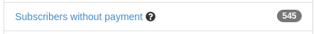
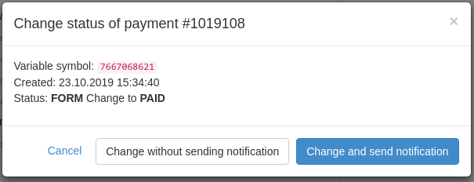
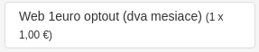
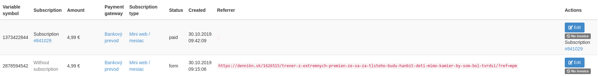
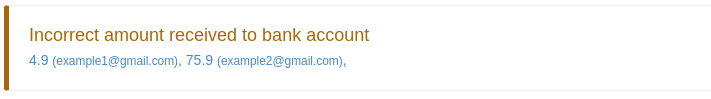
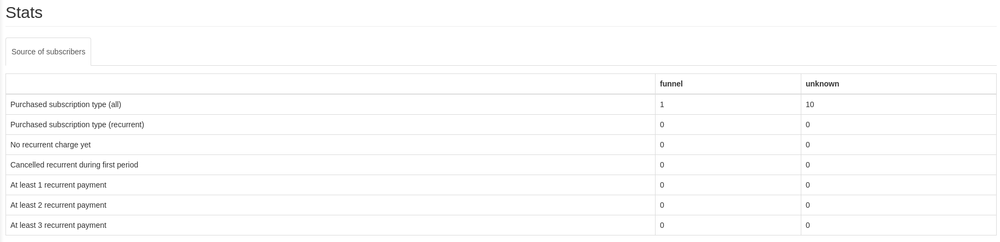
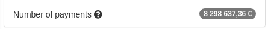
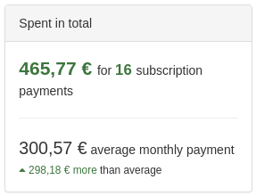
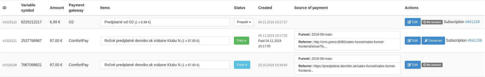

# CRM Payments Module

[](https://hosted.weblate.org/projects/remp-crm/payments-module/)

## Installing module

We recommend using Composer for installation and update management.

```shell
composer require remp/crm-payments-module
```

### Enabling module

Add installed extension to your `app/config/config.neon` file.

```neon
extensions:
	- Crm\PaymentsModule\DI\PaymentsModuleExtension
```

Add following commands to your scheduler (e.g. *crontab*) and change the path to match your deploy path:

```shell
# charge available recurrent payments
*/15 * * * * flock /tmp/payments_charge.lock /usr/bin/php /var/www/html/bin/command.php payments:charge

# pre-calculate payment-related metadata
04 04 * * * /usr/bin/php /var/www/html/bin/command.php payments:calculate_averages
```

### Configuration

#### Data retention configuration

You can configure time before which `application:cleanup` deletes old repository data and column which it uses by using (in your project configuration file):

```neon
services:
    paymentLogsRepository:
        setup:
            - setRetentionThreshold('-2 months', 'created_at')
```

#### Fast charge check configuration

You can configure fast charge threshold check by adding this to your configuration:

```neon
payments:
    fastcharge_threshold: 24 # default: 24; number of hours (if set to 0 fast charge check is disabled)
```

Fast charge check is done by `RecurrentPaymentsChargeCommand::validateRecurrentPayment` and it prevents system
from repeated charging if error occurs while charging.

### Scheduled commands

For payment module to work correctly, please add execution of following commands to your scheduler. Example displays
crontab usage for execution (alter paths to your deploy paths):

```
# calculate payment related averages; expensive calculations that should be done nightly
04 04 * * * php /var/www/html/bin/command.php payments:calculate_averages

# recurrent payment charges; using flock to allow only single instance running at once
*/15 * * * * flock /tmp/payments_charge.lock /usr/bin/php /var/www/html/bin/command.php payments:charge

### OPTIONAL 

# failcheck to prevent payments not working without anyone noticing (see command options) 
*/10 * * * * php /var/www/html/bin/command.php payments:last_payments_check --notify=admin@example.com

# try to acquire debit card expiration dates for cards that don't have it
*/10 * * * * php /var/www/html/bin/command.php payments:update_recurrent_payments_expires

# stop recurrent payments with expired cards
7 2 1 * * php /var/www/html/bin/command.php payments:stop_expired_recurrent_payments

# if you use Cardpay/Comfortpay gateways and bank sends you email notifications, you can confirm payments based
# on those emails
*/3 * * * * php /var/www/html/bin/command.php payments:tatra_banka_mail_confirmation
```

### Service commands

Module might provide service commands to be run in the deployed environment. Mostly to handle internal changes
and to prevent direct manipulation with the database. You can display required and optional arguments by using
`--help` switch when running the command.

Payments module doesn't provide service commands.

## Payment gateways

Module has a default set of supported payment gateways developed and used by us:

* `free`. Developed for development purposes, to be used for testing payment-related flows.
* `bank_transfer`. Gateway generates unfinished payment and displays user bank account, amount and transaction
identification so the payment can be paired and confirmed later.
* `cardpay` (tatrabanka.sk). One-time card payment provided by Slovak bank.
* `comfortpay` (tatrabanka.sk). Recurrent card payment provided by Slovak bank (CRM is handling charging)
* `csob` (csob.cz). One-time card payment provided by Czech bank.
* `csob_one_click` (csob.cz). Recurrent card payment provided by Czech bank (CRM ish handling charging)
* `paypal` (paypal.com). One-time payment provided by major global provider.
* `paypal_reference` (paypal.com). Recurrent payment provided by major global provider (CRM is handling charging)
* `tatrapay` (tatrabanka.sk). One-time payment linked to Slovak bank's internet banking.

By default, only `bank_transfer` as a default payment gateway is enabled by PaymentsModule. You can enable gateways you wish to use by adding following snippet to your `app/config/config.neon`:

```neon
services:
	# ...
	gatewayFactory:
		setup:
			- registerGateway(free, Crm\PaymentsModule\Gateways\Free)
```

At this moment, there are several gateway implementations you can add to your CRM installation as a separate module:

* [`stripe`](https://github.com/remp2020/crm-stripe-module) (stripe.com). One-time payment provided by major global provider.
* [`stripe_recurrent`](https://github.com/remp2020/crm-stripe-module) (stripe.com). Recurrent payment provided by major global provider (CRM is handling charging)
* [`slsp_sporopay`](https://github.com/remp2020/crm-slsp-sporopay-module) (slsp.sk). One-time payment linked to Slovak bank's internet banking.
* [`vub_eplatby`](https://github.com/remp2020/crm-vub-eplatby-module) (vub.sk). One-time payment linked to Slovak bank's internet banking.

### Standard (one-time) payments

Standard and initial recurrent payment have common beginning of process. Once the system generates instance of new
payment, user can be redirected to payment gateway for processing. Each gateway requires different set of parameters
to be provided, therefore gateway is responsible for generating the redirect URL with all required parameters.
  
As `remp/crm-payments-module` is responsible only for actual payment processing, frontend flow can be managed by our
[`remp/crm-salesfunnel-module`](https://github.com/remp2020/crm-salesfunnel-module) which provides a way to create
sales funnels (payment windows), aggregates statistics and displays user success page after the payment with possibility
to extend it with widgets.
 
After the payment, user is directed back to the CRM. Each gateway provides its own URL where user is directed for
payment completion processing.

If the payment is successful, payments module uses [`PaymentCompleteRedirectManager`](extensions/payments-module/src/Models/SuccessPageResolver/PaymentCompleteRedirectManager.php)
to determine what kind of success page the user should see. If `crm-salesfunnel-module` is used, user is directed
to the success page registered by the module.

The flow of payment processing can be described with following diagram:


### Recurrent payments

#### Initiating payment

If the payment uses gateway that supports recurrent payment, the initial flow is usually the same as with the regular
payments. The difference comes in during processing of successful initial payment.

PaymentsModule creates new instance of *recurrent payment* - a profile defining when the system should charge user again,
and what *subscription type* will the user get when charged.

Each *recurrent payment* instance represent a single payment that will be charged in the future. That means, that if
the charge fails, system creates new *recurrent payment* with charge date calculated based on retry rules and stores
failing information to the original recurrent payment. Similarly, if the charge was successful, new subscription is created
and new *recurrent payment* is defined to be charged in the next period. Thanks to that the system is able to provide
information about each charge attempt for whole history of user charging including the bank approval/failure code.

This is all done on backend without system requiring any kind of user interaction. This block merely explains the
flow and describes the terms so when displayed in CRM admin, the reader understands the displayed data.

#### Automatic charges

To charge the user, add `payments:charge` command to your scheduler. Command doesn't handle concurrent runs - that means
that it's responsibility of your scheduler to prevent multiple overlapping instances of command running at the same time.
Otherwise a user could be charged twice during the same period.

We recommend using `flock` or some other locking tool which will prevent command to be execute while the previous
instance is still running. Following is an example snippet for *crontab* to run the charging every 15 minutes:

```sh
*/15 * * * * flock /tmp/payments_charge.lock /usr/bin/php /var/www/html/bin/command.php payments:charge
``` 

#### Notifying expired cards

If gateway supports it, CRM fetches expiration date for each `cid` (effectively credit card) used to execute recurring charges. Optionally, you can add command to your scheduler that automatically stops expired recurrent payments:

```
# stop recurrent payments with expired cards
7 2 1 * * php /var/www/html/bin/command.php payments:stop_expired_recurrent_payments
```

When recurrent payment is stopped, [`Crm\PaymentsModule\Events\RecurrentPaymentCardExpiredEvent`](./src/Events/RecurrentPaymentCardExpiredEvent.php) is emitted. By default, `PaymentsModule` checks if there's another active recurring payment for user. If there isn't, it sends `NotificationEvent` with `card_expires_this_month` template code.

If you're not satisfied with the default implementation, you can remove the default handler by unregistering it in your module definition:

```php
class FooModule extends Crm\ApplicationModule\CrmModule
{
    // ...
    public function registerEventHandlers(League\Event\Emitter $emitter)
    {
        $emitter->removeListener(
            \Crm\PaymentsModule\Events\RecurrentPaymentCardExpiredEvent::class,
            $this->getInstance(\Crm\PaymentsModule\Events\RecurrentPaymentCardExpiredEventHandler::class)
        );
        // ...
    }
}
```  

### Implementing new gateway

You can implement and integrate new gateways to the CRM if necessary. Based on whether you're implementing standard
or recurrent gateway, you implementation should implement just [`Crm\PaymentsModule\Gateways\PaymentInterface`](./extensions/payments-module/src/Models/Gateway/PaymentInterface.php)
or the former and [`Crm\PaymentsModule\Gateways\RecurrentPaymentInterface`](./extensions/payments-module/src/Models/Gateway/RecurrentPaymentInterface.php).

When implementing a gateway, we recommend extending [`Crm\PaymentsModule\Gateways\GatewayAbstract`](./extensions/payments-module/src/Models/Gateway/GatewayAbstract.php)
to avoid implementing parts which are always similar and would cause code duplication.

Once you have your implementation ready, you need to seed it into the database from within seeder in your own module
(see [PaymentGatewaysSeeder](extensions/payments-module/src/Seeders/PaymentGatewaysSeeder.php) as an example)
and register it into the application's configuration:

```neon
services:
	# ...
	- Crm\FooModule\Gateways\Foo
	# ...
	gatewayFactory:
		setup:
			- registerGateway(foo, Crm\FooModule\Gateways\Foo)
```

Then, add *seeder* that will insert the gateway to database. See [`Crm\PaymentsModule\Seeders\PaymentGatewaysSeeder`](./extensions/payments-module/src/Seeders/PaymentGatewaysSeeder.php)
as an example *seeder* implementation and [register seeders](https://github.com/remp2020/crm-skeleton#registerseeders) section
of CRM skeleton documentation too see how the seeders should be registered in your module.

### Adding PaymentCompletedRedirectResolver

If you want to change the success page displayed to user after the payment based on any arbitrary rule - for example
your gateway might want user to see some special offering or require him to enter some additional data - you can register
*redirect resolver* to process this request. When the payment is confirmed, redirect resolver will decide (based on
priority of registered resolvers) whether to redirect user to a special success page or whether a default success page
(if `remp/crm-salesfunnel-module` is used) is sufficient.

The implementation of redirect resolver can look like this:

```php
<?php

namespace Crm\FooModule\Model;

use Crm\PaymentsModule\Model\PaymentCompleteRedirectResolver;
use Nette\Database\Table\ActiveRow;

class FooPaymentCompleteRedirectResolver implements PaymentCompleteRedirectResolver
{
    public function wantsToRedirect(?ActiveRow $payment, string $status): bool
    {
        if ($payment && $status === self::PAID) {
            return $payment->payment_gateway->code === 'foo_gateway';
        }
        return false;
    }

    public function redirectArgs(?ActiveRow $payment, string $status): array
    {
        if ($payment && $status === self::PAID) {
            return [
                ':Foo:SalesFunnel:Success',
                ['variableSymbol' => $payment->variable_symbol],
            ];
        }
        throw new \Exception('unhandled status when requesting redirectArgs (did you check wantsToRedirect first?): ' . $status);
    }
}
```

In the example the resolver first checked whether the redirection should happen for this particular payment - it should
happen if the payment was done via `foo_gateway`. Then the `redirectArgs` method returns array of arguments,
that will be 1:1 used in Nette's `$this->redirect()` call. User will be redirected to `renderSuccess` method
of `SalesFunnelPresenter` that is implemented in our `FooModule` and presents user our own success page.

When the implementation is ready, resolver needs to be registered in the `app/config/config.neon` with the priority
specifying order of execution of resolvers - higher the number, higher the priority.

```neon
services:
	# ...
	paymentCompleteRedirect:
	 	setup:
	 		- registerRedirectResolver(Crm\FooModule\Model\FooPaymentCompleteRedirectResolver(), 400)
```

#### Bank Transfer landing page

When `bank_transfer` is used, user isn't redirected to external payment gateway provider, but CRM displays payment information that user should use to complete the payment manually.

By default, this is handled by [`BankTransferPresenter`](src/Presenters/BankTransferPresenter.php), but you can use your own custom screen with transfer information by using your own redirect resolver instead of bank transfers' [default resolver](src/Models/SuccessPageResolver/BankTransferPaymentCompleteRedirectResolver.php).

Create the resolver and register it with priority >10 in your `config.neon`.

```neon
services:
	# ...
	paymentCompleteRedirect:
		setup:
			- registerRedirectResolver(Crm\FooModule\BankTransferPaymentCompleteRedirectResolver(), 50)
``` 

## Bank email processing

Sometimes user doesn't finish the whole payment process and quits after the payment was made but before returning to the CRM
for internal payment confirmation. That scenario is always unpleasant as user doesn't have money nor subscription.

To support this scenario, we've added possibility to read bank confirmation emails and try to confirm unfinished payments
based on incoming emails.

The implementation is not universal yet and you'd need to create your own command for checking the mailbox. Please take
a look at two implementations that we included within this package: confirmation commands for [Tatra banka](extensions/payments-module/src/Commands/TatraBankaMailConfirmationCommand.php)
and for [CSOB](extensions/payments-module/src/Commands/CsobMailConfirmationCommand.php).

### Mail downloaders

By default, our mail processing commands (e.g.: [Tatra banka](extensions/payments-module/src/Commands/TatraBankaMailConfirmationCommand.php), [CSOB](extensions/payments-module/src/Commands/CsobMailConfirmationCommand.php)) are using our implementation of mail downloader: [ImapMailDownloader](extensions/payments-module/src/Models/MailDownloader/ImapMailDownloader.php). You can replace this downloader if needed by:

1. creating your own mail downloader which must implement [MailDownloaderInterface](extensions/payments-module/src/Models/MailDownloader/MailDownloaderInterface.php)
2. replacing default implementation with your own in your app config neon file:
```neon
services:
	mailDownloader: Crm\YourModule\Models\MailDownloader\YourMailDownloader
```

## Upgrades

Payments module provides a very basic way how to handle the upgrades. The upgrades are not currently configurable and
work with predefined set of rules. There are 4 type of upgrades available:

* *Shortening*. If user's subscription doesn't end in the near time, system allows upgrade via shortening of actual
subscription. The amount of days to shorten is based on number of remaining days of current subscription and the price
of subscription type user's being upgraded to. Shortening is not trigerred if the shortened subscription would end
sooner than in 14 days.
* *Paid upgrade*. If the shortening is not available, user is offered a paid upgrade. The amount to pay is calculated
based 
* *Paid recurrent*. Triggered when user's current subscription is recurrent and the subscription doesn't end within
the following 5 days. Immediate charge amount is calculated based on upgraded subscription type price and the remaining number
of days of current users's subscription. Next period charge is then made with the price of upgraded subscription.
* *Free recurrent*. If user has less than 5 days of subscription remaining, system allows the free upgrade to higher
subscription. Next period charge is then made with the price of upgraded subscription.

Upgrade options for subscription types are configurable within subscription type detail in CRM admin. Upgrades don't check the content of
each subscription type - therefore they cannot automatically determine that monthly web subscription can be upgraded
to monthly web + print subscription. Each upgrade has to be configured manually and all upgrade options are always
determined based on actual subscription, price of actual subscription type and price of upgraded subscription type.

## Change of VAT rates

If the VAT rate changes in your country, there are two commands that help you update the system. Schedule them to be executed on the date of VAT change.

- `payments:change_vat --original-vat=X --target-vat=Y`
  - Command changes all existing subscription type items and each affected (`type=subscription_type`) payment item. You can test the command before the VAT change date by using `--dry-run` and `--verbose` options.
- `application:change_config_value vat_default Y`
  - Command changes system default VAT to the new default VAT rate. Use this only when the standard VAT rate changes.

## VAT modes

Before each payment is created, CRM internally assigns it one of the VAT modes - one of _B2C_, _B2B_ or _B2B Reverse-charge_ mode. Each payment is then processed according to the selected mode.

B2C mode is selected by default by payments module. If you want to set different mode for a payment, the options are:

- Include invoice module in your CRM configuration. The module provides mode selecting functionality out-of-the-box. It uses invoice address for deciding who is a valid B2B customer. 
- Or implement `VatModeDataProviderInterface` data provider. It provides `getVatMode` function, which decides who is considered a valid B2B customer.

### B2B 

No VAT related changes are applied.

### B2B Reverse-charge

When B2B reverse-charge mode is applied, VAT is not included in the payment. Practically, this is done by subtracting the VAT from the final sum (as if 0% VAT was set). 

### B2C 

No VAT related changes are applied, unless One Stop Shop mode is enabled.

#### One Stop Shop

One Stop Shop (OSS) is an optional VAT feature, that can be turned on for payments made in B2C mode. For more details about its specifics, see https://vat-one-stop-shop.ec.europa.eu/index_en. 

> ⚠ One Stop Shop works for EU countries only.
 
**Prerequisites and setup**

For turning on the OSS feature, you need:

- Populated `vat_rates` table with current VAT rates. See [Vatstack setup](Loading VAT rates using Vatstack service) for more details.

The feature can be turned on in CRM settings in `/admin/config-admin/` in Payments section.

**How it works**

If enabled, each payment is assigned a _payment country_ when the payment is created. Payment country is resolved according to multiple rules, sorted by priority:

- Country provided by `OneStopShopCountryResolutionDataProviderInterface` data provider.
  - For example, `InvoiceModule` resolves the payment country depending on invoice address country.
- Payment address country.
- Explicitly selected payment country, for example by user in sales funnel.
- Derived from previous payment (e.g. for recurrent payments).
- Derived from user's IP address location.

After resolving, _payment country_ is stored along with other payment data. Next, if payment is made outside the default country, OSS adjust VAT rates of the payment items. 

VAT rate is adjusted accordingly:

 - VAT rates for particular payment country are loaded from `vat_rates` DB table.
 - Table `vat_rates` contains only VAT rates of EU countries.
 - If no record is found, system considers that as the third country (outside of EU), **0%** VAT rate is used.
 - Otherwise, one of the loaded VAT rates (each country may have several VAT levels) is set. 
 - VAT rate level is selected either by `OneStopShopVatRateDataProviderInterface` data provider or a "standard" VAT rate is applied. 
   - Data provider may select VAT rate level depending on arbitrary rules, for example, for "print" payment items, "reduced" VAT rate level may be applied.  

## European Union VAT

### Loading VAT rates using Vatstack service

To load current VAT rates of EU member countries, we decided to use free VAT rate service https://vatstack.com/ which handles all issues with official [EU VAT rates list](https://ec.europa.eu/taxation_customs/business/vat/telecommunications-broadcasting-electronic-services/vat-rates_en) for us.

After registration you'll find your API keys on page [Developers->Api Keys](https://dashboard.vatstack.com/keys). Add your public API key into your `config.neon`:

```neon
services:
	vatStackApiClient:
		setup:
			- setApiKey('{VATSTACK_PUBLIC_API_KEY}')
			# or load it from environment variable
			#- setApiKey(@environmentConfig::get('PAYMENTS_VATSTACK_API_KEY'))
```

Or you can provide API key with option `--vatstack_api_key={VAT-STACK-PUBLIC-API-KEY}` when running command.

#### Usage

```sh
# upsert all EU members; API key loaded from config.neon
php bin/command.php payments:upsert_eu_vat_rates
# upsert all EU members; API key loaded from option
php bin/command.php payments:upsert_eu_vat_rates --vatstack_api_key={VAT-STACK-PUBLIC-API-KEY}

# upsert only one country (Slovakia in this example)
php bin/command.php payments:upsert_eu_vat_rates --country_code=SK
```

VAT rates are stored into `vat_rates` table for each EU member country _(linked to `countries` table with foreign key `country_id`)_.

VAT rates do not change often, but we strongly recommend to add this command into your scheduler _(eg. cron)_. Expired VAT rates are kept with column `valid_to` set to date when system _(this command)_ expired them.

### Get current VAT rates for one country

To get current VAT rates for one country, call method `VatRatesRepository->getByCountryAndDate()`.

```php
$country = $this->countriesRepository->findByIsoCode('SK');
// currently valid vat rates for country
$currentVatRates = $this->vatRatesRepository->getByCountry($country);
// country vat rates valid when payment was paid
$pastVatRates = $this->vatRatesRepository->getByCountryAndDate($country, $payment->created_at);
```

## API documentation

All examples use `http://crm.press` as a base domain. Please change the host to the one you use
before executing the examples.

All examples use `XXX` as a default value for authorization token, please replace it with the
real tokens:

* *API tokens.* Standard API keys for server-server communication. It identifies the calling application as a whole.
They can be generated in CRM Admin (`/api/api-tokens-admin/`) and each API key has to be whitelisted to access
specific API endpoints. By default the API key has access to no endpoint. 
* *User tokens.* Generated for each user during the login process, token identify single user when communicating between
different parts of the system. The token can be read:
    * From `n_token` cookie if the user was logged in via CRM.
    * From the response of [`/api/v1/users/login` endpoint](https://github.com/remp2020/crm-users-module#post-apiv1userslogin) -
    you're free to store the response into your own cookie/local storage/session.

API responses can contain following HTTP codes:

| Value | Description |
| --- | --- |
| 200 OK | Successful response, default value | 
| 400 Bad Request | Invalid request (missing required parameters) | 
| 403 Forbidden | The authorization failed (provided token was not valid) | 
| 404 Not found | Referenced resource wasn't found | 

If possible, the response includes `application/json` encoded payload with message explaining
the error further.

---

#### POST `/api/v1/payments/paypal-ipn`

Handles the IPN notifications from PayPal. Follow this [guide](https://developer.paypal.com/api/nvp-soap/ipn/IPNSetup/) to enable IPN notifications for your PayPal account. Use `http://crm.press/api/v1/payments/paypal-ipn` as "Notification URL" (replace `http://crm.press` with your domain).

**Note:** when switching to "live" mode, don't forget to also change the `paypal_ipn_baseurl` config to the live IPN endpoint (see [here](https://developer.paypal.com/api/nvp-soap/ipn/IPNImplementation/)) 

#### GET `/api/v1/payments/variable-symbol`

API call returns unique variable symbol (transaction ID) to be used for new payment instance.

##### *Headers:*

| Name | Value | Required | Description |
| --- |---| --- | --- |
| Authorization | Bearer *String* | yes | User token. Token must belong to user with admin flag. |


##### *Example:*

```shell
curl -X POST \
  http://crm.press:8080/api/v1/payments/variable-symbol \
  -H 'Accept: application/json, text/plain, */*' \
  -H 'Authorization: Bearer XXX'
```

Response:

```json5
{
    "status": "ok",
    "variable_symbol": "2735309229"
}
```

---

#### GET `/api/v1/users/recurrent-payments`

API call returns list of all user's recurrent payments.

##### *Headers:*

| Name | Value | Required | Description |
| --- |---| --- | --- |
| Authorization | Bearer *String* | yes | User token. |

##### *Params:*

| Name | Value | Required | Description |
| --- |---| --- | --- |
| states | *String Array* | no | Filter to return only payments with desired states. Available values: `active`, `user_stop`, `admin_stop`, `pending`, `charged`, `charge_failed`, `system_stop`. |
| chargeable_from | *String* | no | ISO 8601 based date to filter only payments with `charge_at` parameter after the specified date.

##### *Example:*

```shell
curl 'http://crm.press/api/v1/users/recurrent-payments?states[]=active&states[]=user_stop&chargeable_from=2020-07-10T09%3A13%3A38%2B00%3A00' \
--header 'Content-Type: application/json' \
--header 'Authorization: Bearer XXX'
```

Response:

```json5
[
  {
    "id": 154233,
    "parent_payment_id": 1231610,
    "charge_at": "2020-10-07T08:54:00+02:00",
    "payment_gateway_code": "stripe_recurrent",
    "subscription_type_code": "sample",
    "state": "active",
    "retries": 4
  }
]
```

---

#### POST `/api/v1/recurrent-payment/reactivate`

API call to reactivate user's recurrent payment.

Conditions to successfully reactivate recurrent payment:
- RecurrentPayment has to be in `\Crm\PaymentsModule\Repository\RecurrentPaymentsRepository::STATE_USER_STOP` state.
- Next charge of payment has to be in future _(>= now)_.

Changes:
- State of recurrent payment is set to `\Crm\PaymentsModule\Repository\RecurrentPaymentsRepository::STATE_ACTIVE`.

##### *Headers:*

| Name | Value | Required | Description |
| --- |---| --- | --- |
| Authorization | Bearer *String* | yes | User token. |

##### *Payload params:*

| Name | Value | Required | Description |
| --- |---| --- | --- |
| id | *Integer* | yes | RecurrentPayment ID. |

##### *Example:*

```shell
curl -X POST 'http://crm.press/api/v1/recurrent-payment/reactivate' \
--header 'Content-Type: application/json' \
--header 'Authorization: Bearer XXX' \
--data-raw '{
    "id": 999999
}'
```

Response:

_On success HTTP status 200 OK is returned with recurrent payment's details._

```json5
{
  "id": 999999,
  "parent_payment_id": 1234567,
  "charge_at": "2020-10-07T08:54:00+02:00", // charge is not changed when reactivating recurrent
  "payment_gateway_code": "stripe_recurrent",
  "subscription_type_code": "sample",
  "state": "active", // on success, state is always set to `active`
  "retries": 4
}
```

In addition to API responses described at the beginning of [API documentation](#api-documentation) section:

| Value | Description |
| --- | --- |
| 409 Conflict | Recurrent payment cannot be stopped by user _(reason is in error message)_ |

---

#### POST `/api/v1/recurrent-payment/stop`

API call to stop user's recurrent payment.

Conditions to successfully stop recurrent payment:
- RecurrentPayment has to be in `\Crm\PaymentsModule\Repository\RecurrentPaymentsRepository::STATE_ACTIVE` state.

Changes:
- State of recurrent payment is set to `\Crm\PaymentsModule\Repository\RecurrentPaymentsRepository::STATE_USER_STOP`.

##### *Headers:*

| Name | Value | Required | Description |
| --- |---| --- | --- |
| Authorization | Bearer *String* | yes | User token. |

##### *Payload params:*

| Name | Value | Required | Description |
| --- |---| --- | --- |
| id | *Integer* | yes | RecurrentPayment ID. |

##### *Example:*

```shell
curl -X POST 'http://crm.press/api/v1/recurrent-payment/stop' \
--header 'Content-Type: application/json' \
--header 'Authorization: Bearer XXX' \
--data-raw '{
    "id": 999999
}'
```

Response:

_On success HTTP status 200 OK is returned with recurrent payment's details._

```json5
{
  "id": 999999,
  "parent_payment_id": 1234567,
  "charge_at": "2020-10-07T08:54:00+02:00", // charge is not changed when stopping recurrent
  "payment_gateway_code": "stripe_recurrent",
  "subscription_type_code": "sample",
  "state": "user_stop", // this endpoint always sets state to `user_stop`
  "retries": 4
}
```

In addition to API responses described at the beginning of [API documentation](#api-documentation) section:

| Value | Description |
| --- | --- |
| 409 Conflict | Recurrent payment cannot be stopped by user _(reason is in error message)_ |

## Components

**ActualFreeSubscribersStatWidget**

Simple admin dashboard widget showing free subscribers count.



[Source code](https://github.com/remp2020/crm-payments-module/blob/1fee1560e7c9a83fe25ddc579c6af0f4264897df/src/components/ActualFreeSubscribersStatWidget/ActualFreeSubscribersStatWidget.php#L1)

[How to use](https://github.com/remp2020/crm-payments-module/blob/1fee1560e7c9a83fe25ddc579c6af0f4264897df/src/PaymentsModule.php#L136)

**ActualPaidSubscribersStatWidget**

Simple admin dashboard widget showing paid subscribers count.


[Source code](https://github.com/remp2020/crm-payments-module/blob/1fee1560e7c9a83fe25ddc579c6af0f4264897df/src/components/ActualPaidSubscribersStatWidget/ActualPaidSubscribersStatWidget.php#L1)

[How to use](https://github.com/remp2020/crm-payments-module/blob/1fee1560e7c9a83fe25ddc579c6af0f4264897df/src/PaymentsModule.php#L131)

**ChangePaymentStatus**

Admin listing/detail change payment status modal component.



[Source code](https://github.com/remp2020/crm-payments-module/blob/1fee1560e7c9a83fe25ddc579c6af0f4264897df/src/components/ChangePaymentStatus/ChangePaymentStatus.php#L1)

[How to use](https://github.com/remp2020/crm-payments-module/blob/1fee1560e7c9a83fe25ddc579c6af0f4264897df/src/components/UserPayments/UserPaymentsListing.php#L106)

**DeviceUserListingWidget**

Admin user listing device component.


[Source code](https://github.com/remp2020/crm-payments-module/blob/1fee1560e7c9a83fe25ddc579c6af0f4264897df/src/components/DeviceUserListingWidget/DeviceUserListingWidget.php#L1)

[How to use](https://github.com/remp2020/crm-payments-module/blob/1fee1560e7c9a83fe25ddc579c6af0f4264897df/src/PaymentsModule.php#L194)

**DonationPaymentItemListWidget**



[Source code](https://github.com/remp2020/crm-payments-module/blob/1fee1560e7c9a83fe25ddc579c6af0f4264897df/src/components/DonationPaymentItemListWidget/PaymentItemsListWidget.php#L1)

[How to use](https://github.com/remp2020/crm-payments-module/blob/1fee1560e7c9a83fe25ddc579c6af0f4264897df/src/PaymentsModule.php#L190)

**DupliciteRecurrentPayments**

Admin listing of duplicit recurrent payments.


[Source code](https://github.com/remp2020/crm-payments-module/blob/1fee1560e7c9a83fe25ddc579c6af0f4264897df/src/components/DupliciteRecurrentPayments/DuplicateRecurrentPayments.php#L1)

[How to use](https://github.com/remp2020/crm-payments-module/blob/1fee1560e7c9a83fe25ddc579c6af0f4264897df/src/presenters/PaymentsRecurrentAdminPresenter.php#L139)

**LastPayments**

Admin listing of last payments in payment gateway detail. 



[Source code](https://github.com/remp2020/crm-payments-module/blob/1fee1560e7c9a83fe25ddc579c6af0f4264897df/src/components/LastPayments/LastPayments.php#L1)

[How to use](https://github.com/remp2020/crm-payments-module/blob/1fee1560e7c9a83fe25ddc579c6af0f4264897df/src/presenters/PaymentGatewaysAdminPresenter.php#L70)

**MonthAmountStatWidget**

Admin dashboard simple stat widget showing payments amount for last month.


[Source code](https://github.com/remp2020/crm-payments-module/blob/1fee1560e7c9a83fe25ddc579c6af0f4264897df/src/components/MonthAmountStatWidget/MonthAmountStatWidget.php#L1)

[How to use](https://github.com/remp2020/crm-payments-module/blob/1fee1560e7c9a83fe25ddc579c6af0f4264897df/src/PaymentsModule.php#L146)

**MonthToDateAmountStatWidget**

Admin dashboard simple stat widget showing payments amount for last month.


[Source code](https://github.com/remp2020/crm-payments-module/blob/1fee1560e7c9a83fe25ddc579c6af0f4264897df/src/components/MonthToDateAmountStatWidget/MonthToDateAmountStatWidget.php#L1)

[How to use](https://github.com/remp2020/crm-payments-module/blob/1fee1560e7c9a83fe25ddc579c6af0f4264897df/src/PaymentsModule.php#L151)

**MyNextRecurrentPayment**


[Source code](https://github.com/remp2020/crm-payments-module/blob/1fee1560e7c9a83fe25ddc579c6af0f4264897df/src/components/MyNextRecurrentPayment/MyNextRecurrentPayment.php#L1)

[How to use](https://github.com/remp2020/crm-payments-module/blob/1fee1560e7c9a83fe25ddc579c6af0f4264897df/src/PaymentsModule.php#L198)

**ParsedMails**

Payments admin widget showing payments with wrong amount.



[Source code](https://github.com/remp2020/crm-payments-module/blob/1fee1560e7c9a83fe25ddc579c6af0f4264897df/src/components/ParsedMails/ParsedMailsFailedNotification.php#L1)

[How to use](https://github.com/remp2020/crm-payments-module/blob/1fee1560e7c9a83fe25ddc579c6af0f4264897df/src/PaymentsModule.php#L121)

**PaymentItemsListWidget**

Admin listing of payment items in payment detail.


[Source code](https://github.com/remp2020/crm-payments-module/blob/1fee1560e7c9a83fe25ddc579c6af0f4264897df/src/components/PaymentItemsListWidget/PaymentItemsListWidget.php#L1)

[How to use](https://github.com/remp2020/crm-payments-module/blob/1fee1560e7c9a83fe25ddc579c6af0f4264897df/src/PaymentsModule.php#L186)

**SubscribersWithPaymentWidget**

Admin dashboard single stat widget.


[Source code](https://github.com/remp2020/crm-payments-module/blob/1fee1560e7c9a83fe25ddc579c6af0f4264897df/src/components/SubscribersWithPaymentWidget/SubscribersWithPaymentWidget.php#L1)

[How to use](https://github.com/remp2020/crm-payments-module/blob/1fee1560e7c9a83fe25ddc579c6af0f4264897df/src/PaymentsModule.php#L166)

**SubscriptionsWithActiveUnchargedRecurrentEndingWithinPeriodWidget**

Admin listing widget.


[Source code](https://github.com/remp2020/crm-payments-module/blob/1fee1560e7c9a83fe25ddc579c6af0f4264897df/src/components/SubscriptionsWithActiveUnchargedRecurrentEndingWithinPeriodWidget/SubscriptionsWithActiveUnchargedRecurrentEndingWithinPeriodWidget.php#L1)

[How to use](https://github.com/remp2020/crm-payments-module/blob/1fee1560e7c9a83fe25ddc579c6af0f4264897df/src/PaymentsModule.php#L156)

**SubscriptionsWithoutExtensionEndingWithinPeriodWidget**

Admin dashboard stats widget.


[Source code](https://github.com/remp2020/crm-payments-module/blob/1fee1560e7c9a83fe25ddc579c6af0f4264897df/src/components/SubscriptionsWithoutExtensionEndingWithinPeriodWidget/SubscriptionsWithoutExtensionEndingWithinPeriodWidget.php#L1)

[How to use](https://github.com/remp2020/crm-payments-module/blob/1fee1560e7c9a83fe25ddc579c6af0f4264897df/src/PaymentsModule.php#L161)

**SubscriptionTypeReports**

Admin subscription type detail stats widget.



[Source code](https://github.com/remp2020/crm-payments-module/blob/1fee1560e7c9a83fe25ddc579c6af0f4264897df/src/components/SubscriptionTypeReportsWidget/SubscriptionTypeReports.php#L1)

[How to use](https://github.com/remp2020/crm-payments-module/blob/1fee1560e7c9a83fe25ddc579c6af0f4264897df/src/PaymentsModule.php#L181)

**TodayAmountStatWidget**

Admin dashboard simple single stat widget.


[Source code](https://github.com/remp2020/crm-payments-module/blob/1fee1560e7c9a83fe25ddc579c6af0f4264897df/src/components/TodayAmountStatWidget/TodayAmountStatWidget.php#L1)

[How to use](https://github.com/remp2020/crm-payments-module/blob/1fee1560e7c9a83fe25ddc579c6af0f4264897df/src/PaymentsModule.php#L141)

**TotalAmountStatWidget**

Admin dashboard simple single stat widget.



[Source code](https://github.com/remp2020/crm-payments-module/blob/1fee1560e7c9a83fe25ddc579c6af0f4264897df/src/components/TotalAmountStatWidget/TotalAmountStatWidget.php#L1)

[How to use](https://github.com/remp2020/crm-payments-module/blob/1fee1560e7c9a83fe25ddc579c6af0f4264897df/src/PaymentsModule.php#L126)

**TotalUserPayments**

Admin user detail stat widget.



[Source code](https://github.com/remp2020/crm-payments-module/blob/1fee1560e7c9a83fe25ddc579c6af0f4264897df/src/components/TotalUserPayments/TotalUserPayments.php#L1)

[How to use](https://github.com/remp2020/crm-payments-module/blob/1fee1560e7c9a83fe25ddc579c6af0f4264897df/src/PaymentsModule.php#L116)

**UserPayments**

Admin user detail listing widget.



[Source code](https://github.com/remp2020/crm-payments-module/blob/1fee1560e7c9a83fe25ddc579c6af0f4264897df/src/components/UserPayments/UserPaymentsListing.php#L1)

[How to use](https://github.com/remp2020/crm-payments-module/blob/1fee1560e7c9a83fe25ddc579c6af0f4264897df/src/PaymentsModule.php#L111)

## Confirmation e-mails

Examples of confirmation mails received from banks. Every type of mail has it's own IMAP access configurable in application configuration.

### TatraBanka Simple

**From:** b-mail (at) tatrabanka (dot) sk

**Subject:** e-commerce

[Example e-mail file](docs/tatrabanka_simple.eml)

### TatraBanka

**From:** b-mail (at) tatrabanka (dot) sk

**Subject:** Kredit na ucte

[Example e-mail file](docs/tatrabanka.eml)

### TatraBanka Statement

**From:** vypis_obchodnik (at) tatrabanka (dot) sk

[Example e-mail file](docs/tatrabanka_statement.eml)

### CSOB

**From:** notification (at) csob (dot) cz

**Subject:** CEB Info: Zaúčtování platby

[Example e-mail file](docs/csob.eml)

### Slovak CSOB

**From:** AdminTBS (at) csob (dot) sk

**Subject:** ČSOB Info 24 - Avízo

[Example e-mail file](docs/sk_csob.eml)

